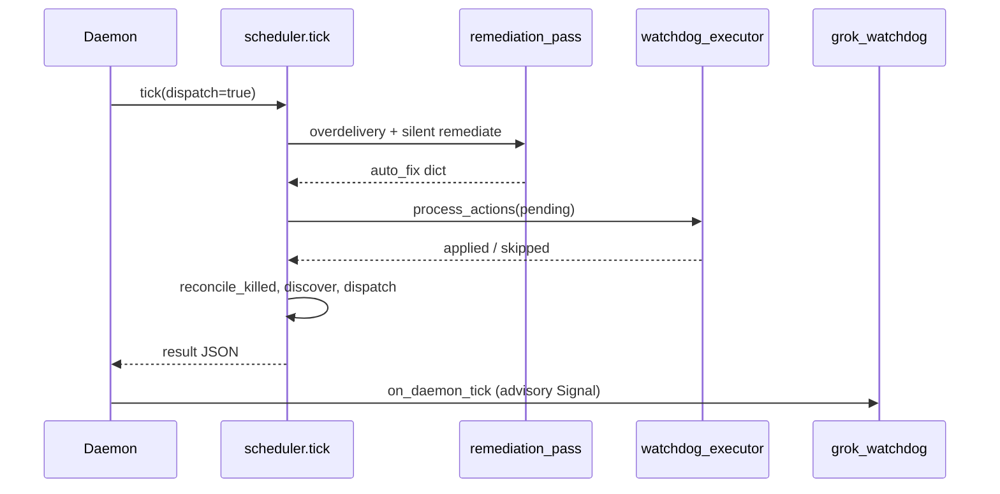

# Grok Watchdog Intelligence — Angle B: Closed-Loop Control

**Date:** 2026-05-28  
**Status:** Research / design — no implementation in this pass  
**Parent:** [GROK_WATCHDOG_INTELLIGENCE.md](./GROK_WATCHDOG_INTELLIGENCE.md) (Watchdog Brain tiers)  
**Fleet context:** [MULTITASK_RESEARCH.md](./MULTITASK_RESEARCH.md) §4 Option A — **Fleet Control Plane**

---

## 1. What Angle B adds

Angle A (Tier 1) writes **`state/watchdog-recommendations.json`** — judgments and suggested actions the daemon may log or surface on Signal. **Angle B (Tier 2)** promotes approved items into a durable **`state/watchdog-actions.json`** queue that the **daemon tick consumes** after deterministic remediation, using the same Python entry points as `autocode` CLI — never shelling out to `autocode drive` from Grok.

```
Grok watchdog (--trigger …)
        │  ===WATCHDOG_JSON===  (optional promote)
        ▼
state/watchdog-actions.json   ← pending | applied | rejected
        │
        ▼
watchdog_executor.process_actions(store, scheduler)   [new module]
        │  allowlist + caps + needs_luke gates
        ▼
goals · recovery · remediation · JobRunner · Store
        │
        ▼
scheduler.tick() continues → discover → dispatch
```

**Separation of powers (unchanged):**

| Layer | Writes SQLite / kills PIDs? |
|-------|-----------------------------|
| `~/bin/autocode-grok-watchdog` | **No** — read-only SELECT/logs; may append JSON files only |
| `watchdog_executor` (daemon) | **Yes** — via existing `Store` / `JobRunner` / `goals` / `recovery` |
| `~/bin/autocode-watchdog` | **Yes** — deterministic kill + `drive`; stays separate from Grok |

---

## 2. Action queue schema (`watchdog-actions.json`)

Path: `$AUTOCODE_HOME/state/watchdog-actions.json` (alongside `grok-watchdog-pending.json`, `audit.jsonl`).

```json
{
  "version": 1,
  "pending": [
    {
      "id": "wa-20260528-cursor-auth-001",
      "created_at": "2026-05-28T18:04:12Z",
      "expires_at": "2026-05-28T18:19:12Z",
      "source": "grok_watchdog",
      "trigger": "job_failed,running_external_idle",
      "action": "retry_with_prompt",
      "chat_id": "cursor:cli:…",
      "job_id": "job-abc123",
      "params": {
        "prompt_prefix": "REMEDIATION: …",
        "immediate": true,
        "failure_kind": "silent_failed"
      },
      "confidence": 0.82,
      "requires_human": false,
      "idempotency_key": "sha256(cursor:cli:…|retry_with_prompt|job-abc123)"
    }
  ],
  "applied": [],
  "rejected": []
}
```

| Field | Purpose |
|-------|---------|
| `id` | Stable action id for audit + Signal approval replies |
| `expires_at` | Drop stale actions (default TTL 15m) |
| `idempotency_key` | Skip duplicate apply within 1h |
| `requires_human` | Leave in `pending` until Hermes/Signal YES or MCP `autocode_apply_action` |
| `job_id` | Optional scope for `kill_job` / retry correlation |

**Producer:** shell script parses `===WATCHDOG_JSON===` from Grok output and appends to `pending` (or copies from `watchdog-recommendations.json` when `confidence` ≥ `AUTOCODE_WATCHDOG_AUTO_THRESHOLD`). **Consumer:** `watchdog_executor` only — not Grok.

---

## 3. Daemon tick integration

Today (`daemon.py` → `scheduler.tick`):

```text
runner.refresh()
goals.reconcile_done_still_in_queue + reconcile_false_done_chats
remediation.remediation_pass()          # overdelivery, silent kill+retry
recovery.reconcile_killed_chats()
cleanup_stale_leases → discover → dispatch
grok_watchdog.on_daemon_tick()          # advisory writeup only
```

**Proposed insert** (after `remediation_pass`, before `reconcile_killed_chats`):

```python
# scheduler.tick() — pseudocode
auto_fix = remediation.remediation_pass(self.store)
action_result = watchdog_executor.process_actions(self.store, self)  # NEW
auto_fix["watchdog_actions"] = action_result
```

Rationale: remediation may already kill/retry; the executor must **not fight** it — skip `kill_job` / `retry_with_prompt` when `remediation_attempts` just incremented on the same job in this tick. Run **before** dispatch so `complete_chat` / `change_goal` affect the same tick’s candidate set.

Env knobs:

| Variable | Default | Effect |
|----------|---------|--------|
| `AUTOCODE_WATCHDOG_AUTO` | `off` | Master switch for auto-apply |
| `AUTOCODE_WATCHDOG_MAX_PER_TICK` | `3` | Cap actions per tick |
| `AUTOCODE_WATCHDOG_MAX_PER_HOUR` | `20` | Rolling cap |
| `AUTOCODE_WATCHDOG_AUTO_THRESHOLD` | `0.9` | Min confidence for promote from recommendations |

Every apply/skip → `config.AUDIT_LOG` (`state/audit.jsonl`) + `store.event("watchdog_action", …)`.

---

## 4. Action vocabulary → codebase

| Action | Implementation target | CLI equivalent | Auto-apply (Phase B) |
|--------|----------------------|----------------|----------------------|
| **`complete_chat`** | `goals.mark_goal_complete(store, chat_id, reason, …)` | `autocode done <query>` (stronger: marks done + archive) | Yes if `detect_overdelivery` **or** `decompose_impossible` already fired; optional Grok double-check |
| **`retry_with_prompt`** | Set `metadata_json.remediation_prompt_prefix`; `recovery.schedule_retry(…, immediate=True)`; `store.queue_bump_front` | Implicit on next `tick` / `drive` | Yes when remediation already scheduled or `failure_kind` known |
| **`dispatch_provider`** | `metadata_json.provider_hint` + optional `chats.provider` update; next `scheduler.dispatch` / `dispatch_with_prompt` | `autocode drive …` with different provider (manual) | Phase B2 — **not** if `recovery.provider_in_backoff` |
| **`kill_job`** | `JobRunner(store).kill_chat_jobs(chat_id, reason)` | — (watchdog bin uses this) | Rare — only when `attempt_silent_remediation` would kill anyway |
| **`change_goal`** | `store.set_goal(chat_id, objective, source="watchdog")` | `autocode drive <query> --goal "…"` | **Never** auto — `requires_human: true` |
| **`spawn_workstream`** | Phase 2: `cli.squad_launch` pattern or future `workstreams` table | `autocode squad launch <priority>` | Phase B2 — max N children per parent chat |

### 4.1 `complete_chat`

Maps to `goals.mark_goal_complete` — sets `done=1`, completes `goals` / `project_priorities`, optional `JobRunner.kill_chat_jobs`, `store.queue_archive`.

Executor guardrails:

- Re-run `goals.verify_goal_complete` / `detect_overdelivery` unless `params.force_reason` is `impossible_handoff` (matches `decompose_impossible_goal`).
- Refuse if `remediation.needs_luke(store, chat_id)`.

### 4.2 `retry_with_prompt`

Mirrors `remediation.attempt_silent_remediation` tail:

1. `metadata["remediation_prompt_prefix"]` — consumed in `scheduler._row_with_plan` (pops prefix into `prior_job_context`).
2. `recovery.schedule_retry(store, chat_id, kind=…, immediate=params.get("immediate", True))`.
3. Does **not** call `subprocess` for `grok`/`codex` directly — next tick’s `dispatch` builds the plan.

### 4.3 `dispatch_provider`

```python
# executor sketch
meta = chat_metadata(row)
meta["provider_hint"] = params["provider"]  # e.g. grok, codex
if params.get("set_provider"):
    store.update chat provider column  # explicit lane switch
store.queue_bump_front(chat_id)
# optional: scheduler.dispatch_with_prompt(row, params.get("prompt")) if immediate
```

`scheduler.dispatch` already respects `recovery.provider_in_backoff` and `should_use_fallback` → `fallback_plan`. Provider hint is a **soft preference** until Phase B2 adds hard affinity in `candidates()`.

### 4.4 `kill_job`

`JobRunner.kill_chat_jobs(chat_id, reason=f"watchdog_{params.get('reason','action')}")`.

Auto-apply only when evidence is `running_silent` / `running_external_idle` past threshold — same predicates as `attempt_silent_remediation`. Never mass-kill fleet.

### 4.5 `change_goal`

`store.set_goal(chat_id, params["objective"], source="watchdog_approved")` — bumps queue, resets `done=0`, supersedes prior active goal.

Human gate: Signal *"Reply YES wa-… to apply change_goal"* → Hermes inbound → MCP `autocode_apply_action`.

### 4.6 `spawn_workstream`

Aligns with **Fleet Control Plane** workstreams ([MULTITASK_RESEARCH.md](./MULTITASK_RESEARCH.md) §4–5):

- **Near-term:** `spawn_workstream` → `store.add_priority` + `cli.squad_launch` (synthetic `squad:<priority_id>:<lane>` chats, max 4 lanes).
- **Target:** `workstreams(id, parent_chat_id, provider, depends_on_json, status)` + scheduler DAG fill.

Params example: `{ "parent_chat_id", "lane": "diff-reviewer", "provider": "codex", "objective": "…" }`.

---

## 5. Mapping to `store.py`, scheduler, CLI

| Concern | Module / API |
|---------|----------------|
| Queue order | `store.queue_bump_front`, `store.queue_move` |
| Goals | `store.set_goal`, `goals.mark_goal_complete`, `goals.auto_complete_overdelivery` |
| Jobs | `jobs` table via `JobRunner`; `store.event` for audit trail |
| Retry/backoff | `recovery.schedule_retry`, `recovery.provider_in_backoff`, `chats.metadata_json` |
| Remediation | `remediation.remediation_pass`, `remediation.needs_luke`, `decompose_impossible_goal` |
| Dispatch | `scheduler.dispatch`, `scheduler.dispatch_with_prompt`, `scheduler.tick` |
| Discovery | `scheduler._maybe_discover` / `discover()` — unchanged |
| Human CLI | `autocode done`, `autocode drive`, `autocode pause`, `autocode squad launch`, `autocode tick`, `autocode doctor --auto-fix` |

`autocode doctor --auto-fix` already runs `remediation.remediation_pass` without full tick — future: `autocode watchdog apply` for one-shot drain of `pending` (testing).

**`grok_watchdog.py`:** unchanged debounce; optional `request("watchdog_action_applied")` after executor runs for richer Signal context.

---

## 6. Fleet Control Plane alignment

Angle B is the **on-host actuator** for the same mutations the Fleet Control Plane will expose via MCP/HTTP ([MULTITASK_RESEARCH.md](./MULTITASK_RESEARCH.md) §5):

| MCP tool (Phase 1 POC) | Watchdog action equivalent |
|------------------------|------------------------------|
| `autocode_drive` | `change_goal` + queue bump + optional immediate dispatch |
| `autocode_done` | `complete_chat` |
| `autocode_pause` | `pause_chat` (extension) |
| `autocode_workstream_spawn` | `spawn_workstream` |

Design rule: **`watchdog_executor` and MCP handlers call shared functions** (e.g. `fleet_actions.apply_complete_chat(store, chat_id, …)`) so Signal-approved actions and API clients cannot diverge.

```
Hermes / Cursor MCP          Grok JSON queue
        │                            │
        └──────────┬─────────────────┘
                   ▼
          fleet_actions.py  (shared)
                   ▼
            scheduler.tick
```

---

## 7. MCP / HTTP sketch (Angle B consumers)

| Tool | Behavior |
|------|----------|
| `autocode_watchdog_status` | Read `watchdog-actions.json` + last `watchdog-recommendations.json` + pending Grok debounce |
| `autocode_watchdog_enqueue` | Append validated action (agent-proposed; still gated) |
| `autocode_apply_action` | `{ "id": "wa-…" }` — human confirmed; moves pending → applied |
| `autocode_reject_action` | `{ "id", "reason" }` |

HTTP mirror (Phase 1 POC extension):

```http
GET  /v1/watchdog/actions
POST /v1/watchdog/actions        # enqueue (auth token)
POST /v1/watchdog/actions/{id}/apply
```

Idempotency: `Idempotency-Key` header = `idempotency_key` in JSON.

---

## 8. Example flow A — Cursor auth / bridge stall

**Symptoms:** `running_external_idle`, objective mentions cursor authentication / my-machines / bridge; stderr matches `CURSOR_BRIDGE_CLOSED` regex in `remediation.py`.

**Deterministic path (already):**

1. `attempt_silent_remediation` → `kickstart_my_machines_worker` → `remediation_prompt_prefix` + kill + `schedule_retry(immediate=True)`.
2. After `DEFAULT_MAX_REMEDIATION_ATTEMPTS` (2) → `decompose_impossible_goal` → handoff markdown + `mark_goal_complete`.

**Angle B JSON sequence:**

```json
{
  "pending": [
    {
      "id": "wa-cursor-001",
      "action": "retry_with_prompt",
      "chat_id": "cursor:cli:sync-handoff",
      "params": {
        "prompt_prefix": "REMEDIATION: Bridge closed. Verify launchctl kickstart -k gui/$UID/com.cursor.my-machines-worker. Document per-chat IDE→cloud handoff. End with FLEET_DONE when handoff doc is complete.",
        "immediate": true,
        "failure_kind": "silent_failed"
      },
      "confidence": 0.75,
      "requires_human": false,
      "expires_at": "2026-05-28T18:30:00Z"
    }
  ]
}
```

If attempt 2 still idle and Grok recognizes API impossibility **before** daemon decomposition:

```json
{
  "id": "wa-cursor-002",
  "action": "complete_chat",
  "chat_id": "cursor:cli:sync-handoff",
  "params": {
    "reason": "impossible bulk API — handoff documented",
    "force_reason": "impossible_handoff"
  },
  "confidence": 0.88,
  "requires_human": false
}
```

Executor: apply only if `record_remediation` count ≥ 2 **or** handoff file exists under `state/remediation/cursor-handoff-*.md`. Otherwise reject → `rejected` with `reason: "premature_complete"`.

**Never auto:** `dispatch_provider` back to `cursor` while `provider_health.backoff_until` active.

---

## 9. Example flow B — Simplicity over-delivery (0xbe)

**Symptoms:** Many `worked` jobs; stdout contains `txid=`, `deployment active=true`, repeated `FLEET_DONE`; `fleet_report` stuck pattern `OVERDELIVERY [auto-complete on tick]`.

**Deterministic path (already):** `goals.detect_overdelivery` → `remediation_pass` → `goals.auto_complete_overdelivery` → `mark_goal_complete` + archive.

**Angle B — confirm or accelerate:**

```json
{
  "pending": [
    {
      "id": "wa-simplicity-001",
      "action": "complete_chat",
      "chat_id": "grok:…:simplicity-0xbe",
      "params": {
        "reason": "overdelivery: stable proof keys txid + deployment_active",
        "archive": true
      },
      "confidence": 0.96,
      "requires_human": false,
      "idempotency_key": "overdelivery|grok:…:simplicity-0xbe|20260528"
    }
  ]
}
```

Executor logic:

```python
if action == "complete_chat":
    if not goals.detect_overdelivery(store, chat_id):
        if not params.get("force_reason") == "impossible_handoff":
            reject("no_overdelivery_evidence")
    goals.mark_goal_complete(store, chat_id, params["reason"])
```

Optional follow-up (Phase B2) — **not** auto by default:

```json
{
  "id": "wa-simplicity-002",
  "action": "spawn_workstream",
  "params": {
    "parent_chat_id": "grok:…:simplicity-0xbe",
    "lane": "diff-reviewer",
    "provider": "codex",
    "objective": "Review whether new txid is net-new work or duplicate proof"
  },
  "requires_human": true
}
```

Use when Luke wants parallel verification before closing — complements deterministic auto-complete, does not replace it.

---

## 10. Safety summary

1. **Fail closed** — invalid schema / expired / `needs_luke` → stay pending or reject; never partial SQLite writes.
2. **Idempotency** — same `idempotency_key` within 1h → no-op apply.
3. **No Grok subprocess writes** — queue file append from shell only; mutations only in `watchdog_executor`.
4. **Caps** — per-tick and per-hour limits; `kill_job` and `change_goal` heavily gated.
5. **Coexistence** — `autocode-watchdog` remains fast kill+`drive`; Grok queue does not shell to `autocode drive`.

---

## 11. Implementation checklist (Angle B)

- [ ] `autocode/watchdog_executor.py` — `process_actions`, `apply_action`, allowlist
- [ ] Hook in `scheduler.tick` after `remediation_pass`
- [ ] Parse/enqueue in `~/bin/autocode-grok-watchdog` from `===WATCHDOG_JSON===`
- [ ] Tests: cursor-auth stall sequence, overdelivery double-confirm, `needs_luke` blocks apply
- [ ] Shared `fleet_actions` stubs for upcoming MCP ([MULTITASK_RESEARCH.md](./MULTITASK_RESEARCH.md) Phase 1)

---

## Appendix — tick ordering diagram



---

*Angle B turns the Grok Watchdog from fleet narrator into a **gated actuator** — still subordinate to `remediation_pass`, `needs_luke`, leases, and retry caps defined in `scheduler.py`, `store.py`, and `recovery.py`.*
